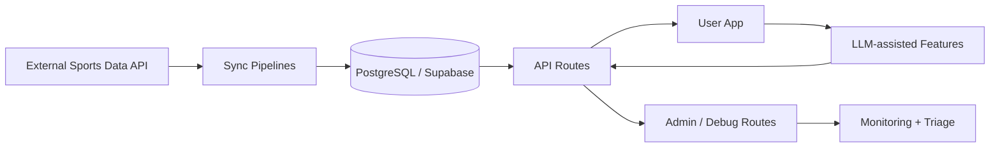

# X2ODDS2026 Engineering Showcase

Public technical showcase for an AI analytics engineering project focused on reliability, data pipelines, and LLM-backed workflows.

> This repository is intentionally sanitized. Production code, secrets, commercial logic, and partner data are private.

## Why this repository exists

This repo demonstrates hands-on engineering capability without exposing business IP:

- AI/data backend architecture and operations mindset
- SQL data modeling and schema evolution
- Pipeline reliability checks and operational debugging
- LLM integration with structured constraints

## Project snapshot

- `70+` API route handlers across ingestion, assistant, admin, and monitoring flows
- `20` SQL migration files in the current project branch
- Production-oriented sync and validation workflows
- LLM intent extraction + constrained JSON schema parsing

## What is included here

- `docs/case-study.md`: engineering narrative and reliability lessons
- `docs/security-boundary.md`: what is public vs private
- `docs/publish-checklist.md`: pre-publish safety checks
- `samples/cron-sync-snippet.ts`: tiered sync cadence + lifecycle logic (sanitized)
- `samples/sync-endpoint-snippet.ts`: authenticated sync route pattern (sanitized)
- `samples/llm-intent-schema-snippet.ts`: JSON-schema-based LLM extraction (sanitized)
- `samples/sql-migration-snippet.sql`: migration + RLS pattern (sanitized)

## Architecture (high-level)

## Reliability approach

- Validate data and sync status before exposing outputs.
- Track operational state for repeatable cron-like execution.
- Use explicit constraints for LLM outputs (JSON schema, low temperature).
- Add debug routes and refresh controls to reduce time-to-triage.

## Stack

- TypeScript / Next.js route handlers
- PostgreSQL / Supabase
- LLM API integration (`@google/genai`)
- SQL migrations for schema lifecycle

## Notes

- No secrets, keys, customer data, or proprietary ranking logic are included.
- Screenshots and a short walkthrough can be provided on request.
