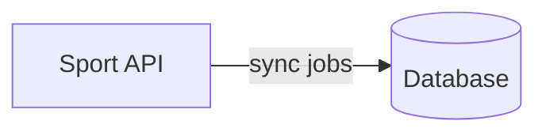
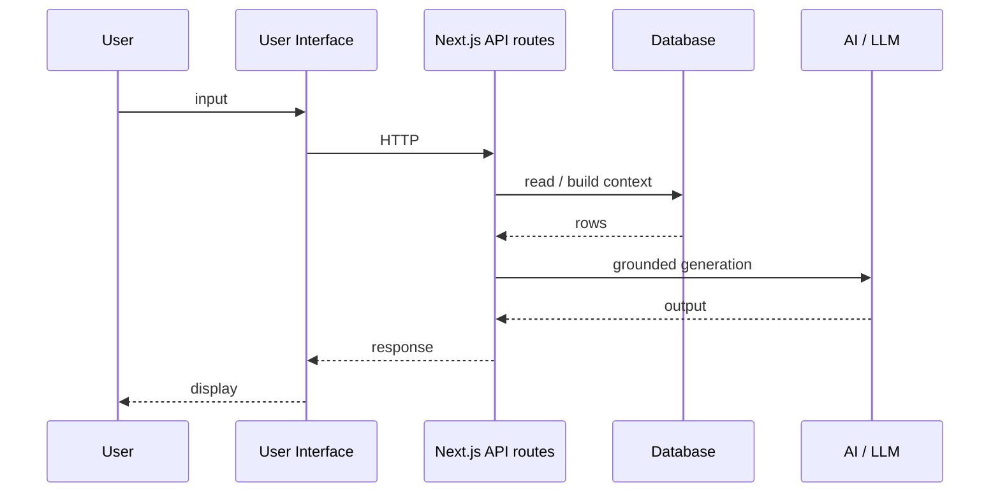

# Overview: Sport API ↔ Database ↔ AI ↔ User Interface ↔ User

This page complements **[`06-end-to-end-process.md`](06-end-to-end-process.md)** with diagrams. The **canonical** text for the five-part chain is in doc **06**.

---

## 1) The chain (same as README)

```
Sport API  ↔  Database  ↔  AI  ↔  User Interface  ↔  User
```

- **Sport API:** external REST data source.  
- **Database:** PostgreSQL / Supabase — internal source of truth for app reads.  
- **AI:** server-side orchestration + LLM calls.  
- **User Interface:** Next.js + React.  
- **User:** human operator in the browser.

---

## 2) Data plane (Path A): refresh the database



- Runs on a schedule or admin trigger.  
- Goal: tables stay current for the interactive path.

---

## 3) Interactive plane (Path B): User ↔ … ↔ answer



---

## 4) API surface (categories)

The private app exposes many routes; groups include **sync/ingestion**, **assistant/chat**, **user features**, **admin/debug**. Exact paths are omitted in this public documentation.

---

## Next

- [`01-sport-api-and-sync.md`](01-sport-api-and-sync.md) — Sport API ↔ Database details  
- [`03-ai-layer.md`](03-ai-layer.md) — Database ↔ AI details  
- [`04-frontend.md`](04-frontend.md) — User Interface ↔ User details  
