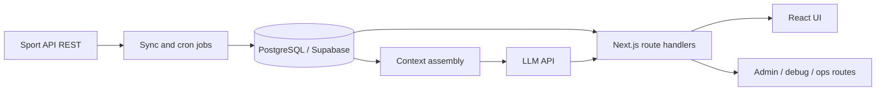

# Overview: Sport API -> Database -> AI -> UI

## Diagram (logical)

## System flow

1. **Sport API ingestion**
   - External data is fetched in controlled windows.
   - Sync jobs write normalized records into PostgreSQL/Supabase.

2. **Database as operational truth**
   - The app reads primarily from internal tables.
   - Data lifecycle is managed through SQL migrations and repeatable scripts.

3. **AI orchestration layer**
   - User intent is interpreted and mapped to relevant entities.
   - The model receives structured, DB-backed context (not just raw prompt text).
   - Guardrails/constraints are applied to improve consistency.

4. **User interface**
   - Next.js route handlers expose data and AI-assisted endpoints.
   - UI components consume these routes for interactive product features.

## Why this architecture

- Improves reliability versus direct model-only answers
- Reduces coupling to external API latency at user-request time
- Allows data validation and operational monitoring between ingestion and generation
- Supports iterative improvement of both data and AI behaviors

## API surface (categories, not exhaustive)

The main codebase exposes many HTTP routes; groupings include:

- **Data and sync:** ingestion triggers, fixture/odds-related reads, operational refresh
- **Assistant:** chat and related endpoints that assemble DB-backed context
- **User product:** preferences, saved items, personalized feeds (high level)
- **Admin / debug:** internal diagnostics and maintenance paths (server-side only)

Exact paths and handlers are not listed here to keep this documentation lightweight and IP-safe.
