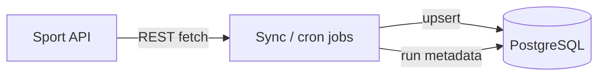
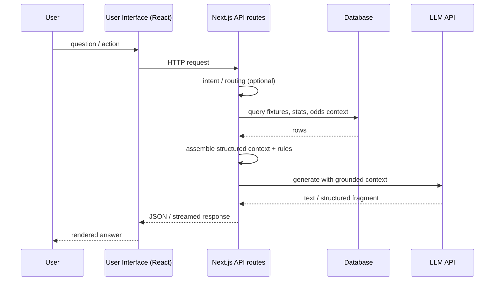

# Overview: Sport API ↔ Database ↔ AI ↔ User Interface ↔ User

This page is the **single picture** of the system: two flows — **data** (keeping the DB fresh) and **interactive** (user asks, system answers using the DB + AI).

---

## 1) The full loop (conceptual)

```
  Sport API          Database           AI              User Interface        User
 (external)      (PostgreSQL/Supabase)  (LLM + logic)      (Next.js / React)
      │                  │                │                      │                │
      │◀──── sync ──────▶│◀── context ───▶│◀── orchestration ───▶│◀── browse / ask ───▶│
      │      jobs        │    reads       │    server-side       │    HTTP/JSON      │
      │                  │                │                      │                │
      │                  │                │                      │──── responses ───┘
      │                  │                │                      │
      └──────────────────┴────────────────┴──────────────────────┘
```

- **Sport API ↔ Database:** pull data in, normalize, store. **Bidirectional** in the sense that sync runs repeatedly; the DB is updated as the API’s view of the world changes.
- **Database ↔ AI:** the model step **reads** from the DB (and optionally joins multiple tables) to build **grounded** context; nothing here replaces your DB with “model memory” for factual domains.
- **AI ↔ User Interface:** the UI does **not** call the LLM vendor directly. It calls **your** backend routes, which orchestrate DB + LLM and return text/JSON to the UI.
- **User Interface ↔ User:** the user only sees the product shell and responses; **no** raw API keys or internal prompts in the browser.

---

## 2) Data plane (background): keeping the database fresh



- Runs on a **schedule** or **admin-triggered** paths (not per user click for bulk data).
- Goal: **stale data** is detected and fixed via **operations**, not by asking the model to guess.

---

## 3) Request plane (foreground): user question → answer



This is the **missing link** many “AI demos” skip: **User → UI → API → DB → AI → UI → User**.

---

## 4) Why this architecture

| Goal | How |
|------|-----|
| Factual consistency | DB-first context for domain facts |
| Low latency UX | Read from DB, not external API per click for bulk data |
| Safe iteration | Change schema + sync + prompts together |
| Operations | Debug routes and sync state help trace “bad answer” vs “bad data” |

---

## 5) API surface (categories only)

Routes are grouped by concern: **sync/ingestion**, **assistant/chat**, **user features**, **admin/debug**. Exact paths are omitted in this public doc.

---

## Next pages

- [`01-sport-api-and-sync.md`](01-sport-api-and-sync.md) — Sport API ↔ Database in detail  
- [`02-database.md`](02-database.md) — Database role  
- [`03-ai-layer.md`](03-ai-layer.md) — Database ↔ AI ↔ API  
- [`04-frontend.md`](04-frontend.md) — UI ↔ User ↔ API  
