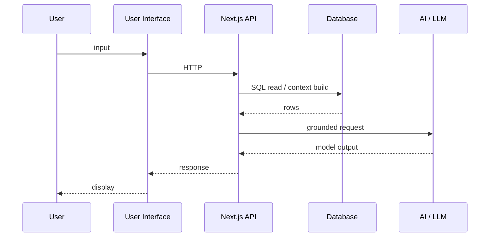

# End-to-end process: Sport API ↔ Database ↔ AI ↔ User Interface ↔ User

This is the **canonical** description of the system. It matches how the product is structured: one **data pipeline** and one **interactive loop**, both using the same five concepts.

---

## 1) The five-part chain (your wording)

```
Sport API  ↔  Database  ↔  AI  ↔  User Interface  ↔  User
```

- **Sport API:** external REST provider for sports data (fixtures, odds, stats, etc.).
- **Database:** PostgreSQL via Supabase — normalized tables, migrations, operational rows.
- **AI:** server-side orchestration plus LLM calls — not “only a prompt in the browser.”
- **User Interface:** Next.js App Router + React — pages, chat, boards, settings.
- **User:** the person using the product in the browser.

---

## 2) Why “↔” and not only “→”

- **Sport API ↔ Database:** sync runs **many times**; data is refreshed, backfilled, and reconciled. The DB is continuously aligned with what the API returns.
- **Database ↔ AI:** each answer can **read** different rows; some flows **write** analytics or state. It is not a one-shot export.
- **AI ↔ User Interface:** the UI calls your backend **repeatedly**; responses drive rendering; new user input triggers new orchestration.
- **User Interface ↔ User:** bidirectional by definition (input and output).

---

## 3) Two concrete paths (recommended mental model)

### Path A — Background: keep the database useful

```text
Sport API  --->  sync / cron / admin triggers  --->  Database
```

No human in this path. Goal: **fresh, consistent** rows for the app to read.

### Path B — Foreground: answer the user

```text
User  --->  User Interface  --->  API routes  --->  Database (read)
                                              --->  AI (LLM)
                                              --->  API routes  --->  User Interface  --->  User
```

Goal: **grounded** answers using DB context + controlled generation.

---

## 4) Mermaid: interactive path only



---

## 5) What is intentionally not in this public repo

Full source tree, `.env`, credentials, complete prompts, partner data, and proprietary business logic live in the **private** repository. This documentation explains **shape and skills**, not a copy-paste of the product.
